  

  

  10+ years building production systems — now focused on <b>LLM-powered automation, AI agents, and the platforms they run on</b>.

<h3 align="center">🤖 AI Engineering</h3>

  
  
  
  
  
  

<h3 align="center">⚙️ Backend & Languages</h3>

  

<h3 align="center">🗄️ Data</h3>

  

<h3 align="center">☁️ Infrastructure & Orchestration</h3>

  

  

